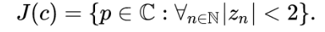

# Julia-set-generator
  Celem projektu jest zwizualizowanie zbioru Julii, przy pomocy generatora tego zbioru i ekranu LCD.
 
  *Przykład wizualizacji zbioru Julii via Wikiepedia*
## Analiza problemu
  Zbiór Julii to szczególny przypadek zbioru Mandelbrota. Definicja: 
  

  
  ...
  
## Realizacja
  Do realizacji projektu zostaną wykorzystanie:
- Płytka (...)
- Ekran LCD (...)
